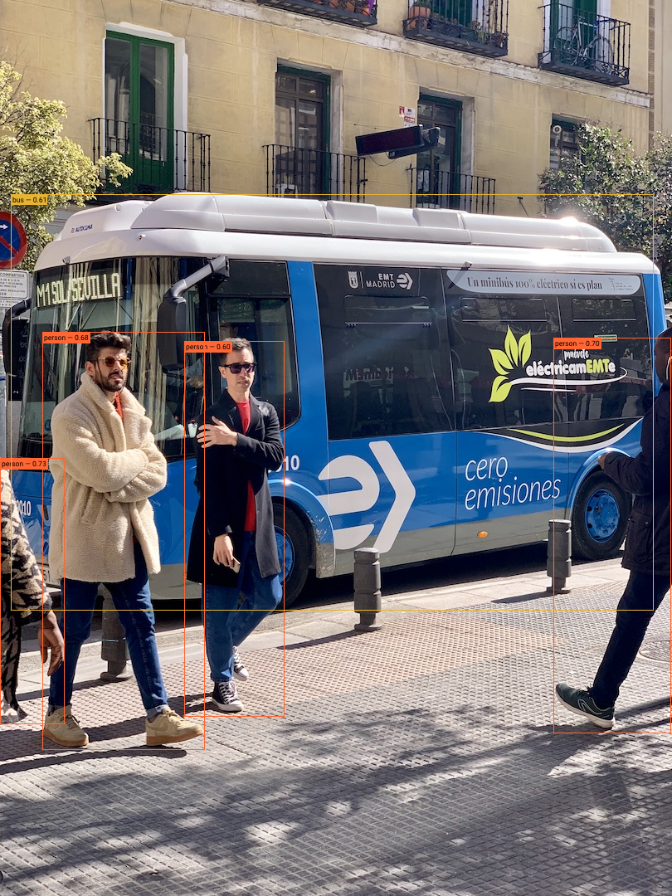

# Simple ONNX inference server for images and videos

For now, only YOLO compatible models are expected to work.
To run the server, put your YOLO converted model into `assets` directory as `best1.onnx`.

To start the server run `cargo run --release --bin server -- --model-version 1`. 
By default, port 3000 will be used.

On Windows it may be necessary to download ffmpeg and set a new environment variable:
`FFMPEG_DIR=D:\ffmpeg-6.0-full_build-shared`

For Linux check out the [Dockerfile](Dockerfile) for required dependencies.

## API
Make a GET request to `/infer` endpoint with a URL to the image, for example:
`http://localhost:3000/infer?url=https://raw.githubusercontent.com/ultralytics/yolov5/master/data/images/bus.jpg`

The response should be similar to this:
```json
{
  "boxes": [
    {
      "frame": 0,
      "x": 0.27407408,
      "y": 0.38055557,
      "width": 0.14938271,
      "height": 0.41944444,
      "class_id": 0,
      "class_name": "person",
      "confidence": 0.59907085
    },
    {
      "frame": 0,
      "x": 0.82345676,
      "y": 0.37685186,
      "width": 0.17530864,
      "height": 0.44166666,
      "class_id": 0,
      "class_name": "person",
      "confidence": 0.7044057
    },
    {
      "frame": 0,
      "x": 0.0,
      "y": 0.51111114,
      "width": 0.096296296,
      "height": 0.29722223,
      "class_id": 0,
      "class_name": "person",
      "confidence": 0.7286054
    },
    {
      "frame": 0,
      "x": 0.016049383,
      "y": 0.21666667,
      "width": 0.95679015,
      "height": 0.4648148,
      "class_id": 5,
      "class_name": "bus",
      "confidence": 0.60946923
    },
    {
      "frame": 0,
      "x": 0.062962964,
      "y": 0.37037036,
      "width": 0.24197531,
      "height": 0.46666667,
      "class_id": 0,
      "class_name": "person",
      "confidence": 0.679659
    }
  ],
  "model_version": 1,
  "error": null
}
```

There is also a `/draw` endpoint that will return the original image with drawn additional boxes that represent detected objects:
`http://localhost:3000/draw?labels=true&url=https://raw.githubusercontent.com/ultralytics/yolov5/master/data/images/bus.jpg`

